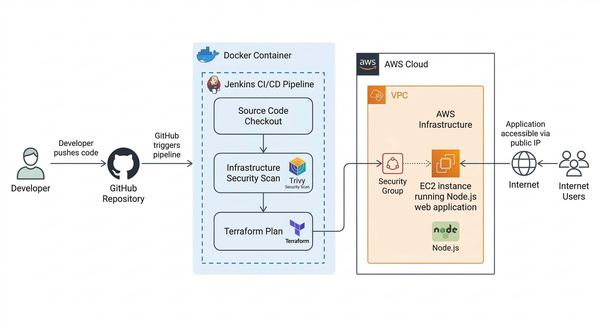
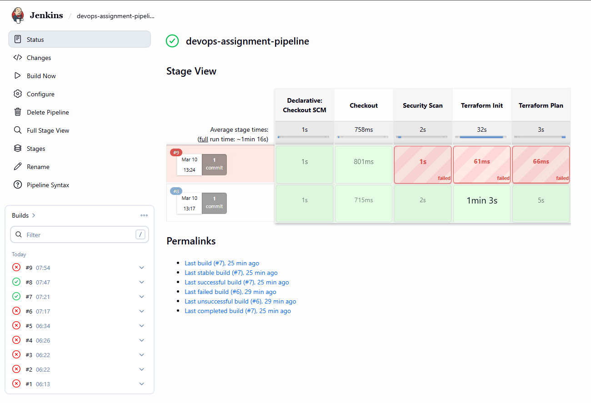
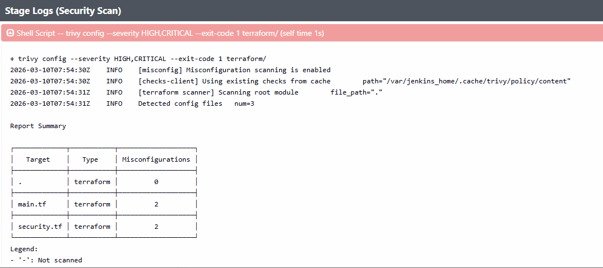
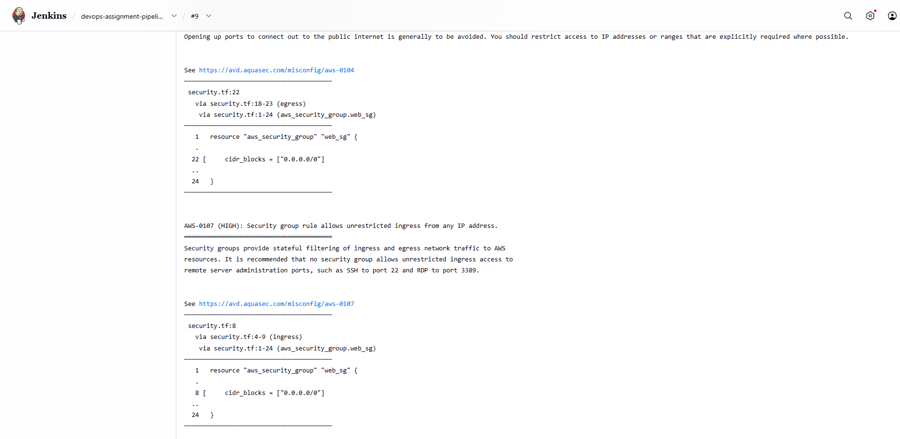
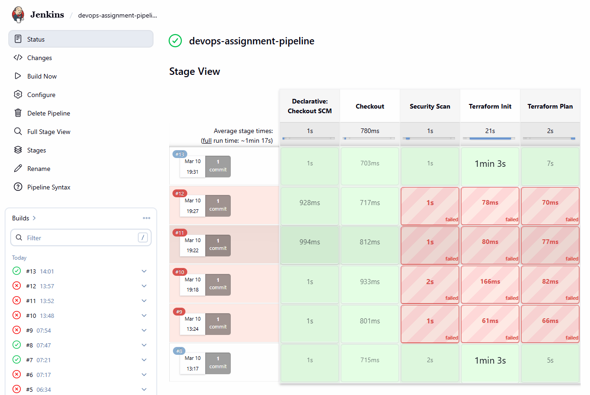
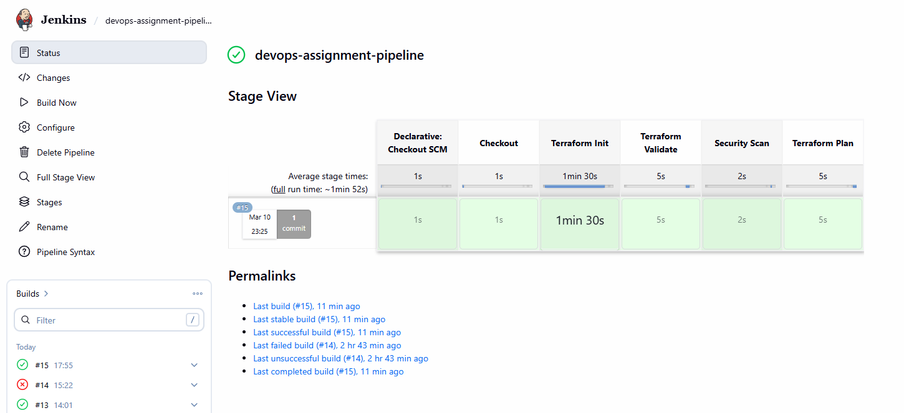
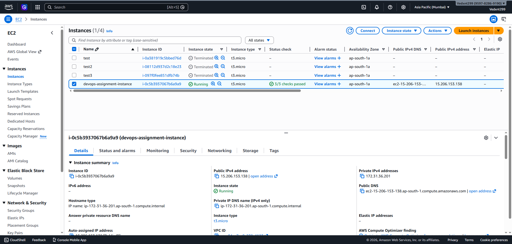
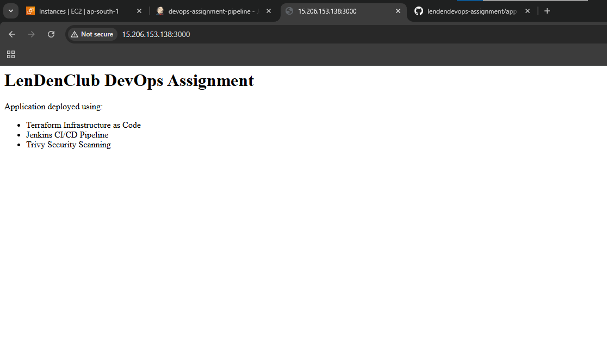

# DevOps Infrastructure Automation Assignment

## Project Overview

This project demonstrates a complete DevSecOps workflow where infrastructure provisioning, security scanning, and application deployment are automated using modern DevOps tools.

The objective of the assignment was to provision secure cloud infrastructure using Terraform, implement security scanning using Trivy, and automate the workflow through a Jenkins CI/CD pipeline.

A Node.js web application was deployed on an AWS EC2 instance using Terraform. The Terraform configuration was scanned for security vulnerabilities using Trivy, and Generative AI was used to analyze and remediate the identified security risks.

The final result is a fully automated DevSecOps pipeline that provisions secure infrastructure and deploys the application to the cloud.

## Architecture

The following diagram illustrates the complete DevSecOps workflow implemented in this project.

### Workflow Explanation

1. A developer pushes code to the GitHub repository.
2. GitHub triggers the Jenkins CI/CD pipeline running inside a Docker container.
3. Jenkins performs the following stages:
    - Source code checkout
    - Infrastructure security scan using Trivy
    - Terraform plan for infrastructure provisioning
4. Terraform provisions AWS infrastructure including:
    - EC2 instance
    - Security group configuration
5. The EC2 instance automatically deploys and runs the Node.js web application.
6. The application becomes accessible via the EC2 public IP through the internet.

## Pipeline Execution & Security Scan Results

Below are screenshots demonstrating the DevSecOps pipeline execution, security scanning process, and successful application deployment.

### Security Vulnerability Detected

During the initial pipeline execution, Trivy detected a security vulnerability in the Terraform configuration.

---

### Trivy Vulnerability Report

The Trivy scan report identified misconfigurations in the infrastructure code.

---

### Security Issue Fixed (AI Remediation)

After analyzing the vulnerability report with Generative AI, the Terraform configuration was updated to remove the insecure configuration.

The Jenkins pipeline was re-run and the scan passed successfully.

---

### Jenkins Pipeline Execution

The Jenkins pipeline automatically performs checkout, security scanning using Trivy, and Terraform planning.

---

### Infrastructure Deployment

Terraform successfully provisioned the AWS EC2 instance.

---

### Application Running on Cloud

The Node.js application was successfully deployed and is accessible via the EC2 public IP.

## AI Usage Log (Security Analysis & Remediation)

Generative AI was used to analyze the infrastructure security vulnerability detected during the Jenkins pipeline execution.

### AI Prompt Used
I am running a Jenkins DevSecOps pipeline that scans my Terraform infrastructure code using Trivy.
The scan detected a security misconfiguration in my AWS security group where a port is open to 0.0.0.0/0.
Explain why this is considered a security vulnerability in cloud infrastructure and what risks it introduces.
Then provide a secure version of the Terraform configuration that follows best practices for restricting access while still allowing the Node.js application running on port 3000 to be accessible from the internet all from a senior DevOps Engineer's point of view. 
I have attached necessary screenshots of the console output for you with terraform files for reference.  

### Identified Security Risk

The Trivy scan reported that the Terraform configuration allowed overly permissive network access.  
Opening management ports (such as SSH) to `0.0.0.0/0` allows any IP address on the internet to attempt access to the server. This increases the risk of:

- Brute force login attempts
- Unauthorized access
- Potential exploitation of exposed services

### AI Recommended Fix

The AI suggested restricting unnecessary open ports and limiting exposed services to only the required application port.

### Security Improvement

After applying the AI recommendation:

- Unnecessary open ports were removed
- Security group rules were restricted
- Only the required application port (3000) remained publicly accessible

The Jenkins pipeline was re-run and the Trivy scan successfully passed with **no critical security issues**.